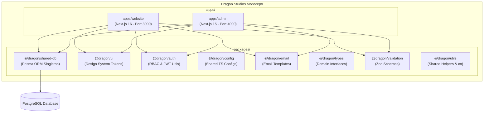

# ARCHITECTURE REPORT — DRAGON STUDIOS OMEGA ENTERPRISE

## System Architecture

---

## Contact System Data Flow (Zero Gmail Dependency)

1. **User Submits Contact Form** (`apps/website`): Form data validated via `@dragon/validation` -> Inserted into PostgreSQL via `@dragon/shared-db`.
2. **Admin Contact Inbox** (`apps/admin`): Real-time query to PostgreSQL -> Filter by status (`UNREAD`, `READ`, `ARCHIVED`, `SPAM`) & priority (`LOW`, `MEDIUM`, `HIGH`, `URGENT`).
3. **Admin Reply System** (`apps/admin`): Admin writes reply -> Calls `@dragon/email` mailer -> Dispatches email automatically -> Updates database audit log.

---

## Enterprise Hardening Highlights

- **Role-Based Access Control (RBAC)**: Managed centrally in `@dragon/auth`.
- **Single Source Database Truth**: `@dragon/shared-db` manages all migrations, client instantiation, and singleton pooling.
- **TurboRepo Build Cache**: Incremental compilation with sub-second cached builds.
